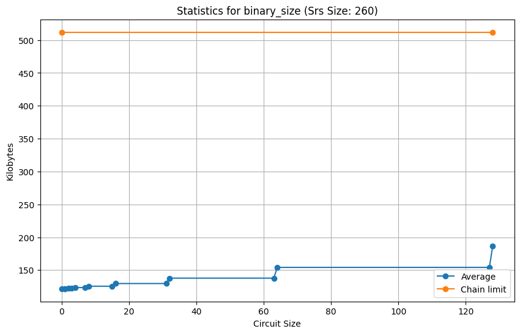

# Benchmark

The purpose of this benchmark is to evaluate our implementation, providing insights into its advantages and identifying potential issues.

## Method

We ran the implementation several times and computed the following metrics: minimum, maximum, average, 95th percentile (f95), and 99th percentile (f99). You can replicate the results using this file: [main.rs](../benchmark/src/main.rs).

## Results

**Note:** Since there are no significant differences between the minimum, maximum, average, f95, and f99 metrics, we will display only the average metric.

### Circuit Size

As shown in the following charts, the bin size and computation cycles change when the circuit size reaches the power of 2 due to the need to pad the circuit to the size of $2^i$. Additionally, both size and cycle count increase linearly with $2^i$, although the increase in binary size is insignificant compared to the cap limit.

We can also see that since the current cycle limit on the CKB main network is 3.5 billion cycles, with the current implementation, we can only prove equations with circuit sizes up to 64. In the future, we could improve this by applying advanced techniques like optimizing the code, using lookup tables, and using recursive proofs.

### SRS Size

**Note:** We can only test the SRS size up to 4000 because we reached the limit of VM memory (4MB).

When increasing the SRS size, the binary size increases linearly.

When increasing the SRS size, the number of running cycles required stays relatively constant compared to the allowed cycles.

## Conclusion

Increasing the SRS size mainly affects the binary size, while increasing the circuit size primarily affects the number of cycles needed.

The main current bottleneck is the circuit size, as we only need the SRS size to be greater than the circuit size by 3.

